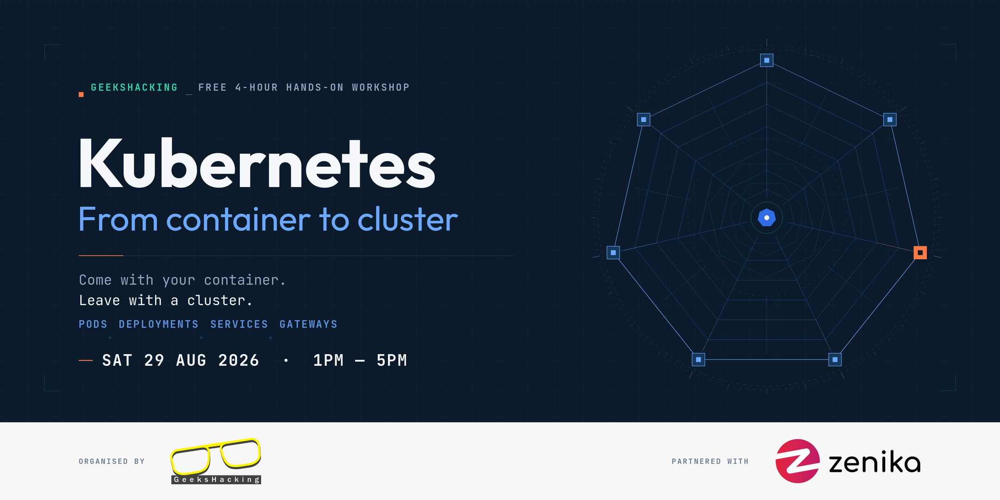

# Kubernetes: From Container to Cluster

Workshop materials from the GeeksHacking hands-on Kubernetes workshop.

**Saturday, 29 August 2026** · 1:00 PM – 5:00 PM · Hosted by [Zenika Singapore](https://zenika.com/en-SG)
Trainer: Chuk Munn Lee · 43 participants

It works on your machine. It works in Docker. This workshop is about what happens next — taking a containerised application and running it as a real workload on a Kubernetes cluster, writing every resource file by hand rather than copy-pasting a Helm chart.

If you attended and didn't finish, everything you need is here. If you didn't attend, the manifests and slides stand on their own.

---

## What's in here

| File | What it is |
|---|---|
| [`pod.yaml`](pod.yaml) | A single Pod running `podinfo`, plus the ConfigMap it reads its message from |
| [`podinfo.yaml`](podinfo.yaml) | The same app as a Deployment with 2 replicas, a Secret, and a Service |
| [`2048.yaml`](2048.yaml) | The take-home challenge — a 2048 game as a Deployment with 3 replicas |
| [`GeeksHacking - Kubernetes_ From Container to Cluster.pdf`](GeeksHacking%20-%20Kubernetes_%20From%20Container%20to%20Cluster.pdf) | The full slide deck |

Slides are also on [Google Slides](https://docs.google.com/presentation/d/1YTQOPgtmsdkagFIhKAIoKBe9dTDPXdw-NSVyeQehUVI/edit?usp=sharing).

---

## Before you start

You need:

- **kubectl** — [installation instructions](https://kubernetes.io/docs/tasks/tools/)
- **An editor that handles YAML** — VS Code, Vim, whatever you're comfortable in
- **A Kubernetes cluster.** During the workshop we used DigitalOcean Kubernetes. Any cluster works, but the Gateway section needs a Gateway API controller installed — we used Cilium's.

### Point kubectl at your cluster

Create a `.kube` directory in your home directory and drop your cluster's kubeconfig into it as `config`:

| OS | Path |
|---|---|
| Linux / macOS | `~/.kube/config` |
| Windows | `C:\Users\<username>\.kube\config` |

Then confirm you're connected:

```bash
kubectl cluster-info
```

If that returns your control plane address, you're ready.

---

## Walkthrough

### 0. Create the namespace

Everything in `pod.yaml` and `podinfo.yaml` lives in the `geekshacking` namespace, so create it first:

```bash
kubectl create namespace geekshacking
```

### 1. A Pod

A Pod is the smallest deployable unit in Kubernetes — a wrapper around one or more tightly-coupled containers that share an IP address, a port space, and storage. Pods are ephemeral by design: if one dies, Kubernetes doesn't repair it, it replaces it.

```bash
kubectl apply -f pod.yaml
kubectl get pods -n geekshacking
kubectl describe pod podinfo -n geekshacking
```

To reach it without a Service, forward a port to your machine:

```bash
kubectl port-forward pod/podinfo 9898:9898 -n geekshacking
```

Then open <http://localhost:9898>.

The app is [`stefanprodan/podinfo:6.14.1`](https://github.com/stefanprodan/podinfo) listening on port **9898**. Its UI message comes from the `PODINFO_UI_MESSAGE` key in the ConfigMap defined at the top of the same file — change it, re-apply, and watch the page change.

### 2. A Deployment and a Service

You almost never create Pods directly. A Deployment declares the state you want — *three replicas of this* — and the control plane reconciles reality against it, continuously. Kill a Pod and a replacement appears.

A Service then gives that shifting set of Pods one stable address. Pods come and go with new IPs; the Service's address does not.

```bash
kubectl delete -f pod.yaml
kubectl apply -f podinfo.yaml
kubectl get all -n geekshacking
```

Try scaling it and watching the reconciliation happen:

```bash
kubectl scale deployment/podinfo --replicas=5 -n geekshacking
kubectl get pods -n geekshacking -w
```

Inside the cluster, the Service is reachable at:

```
podinfo.geekshacking.svc.cluster.local
```

### 3. A Gateway and an HTTPRoute

The last step in the workshop was routing external traffic to the Service using the [Gateway API](https://gateway-api.sigs.k8s.io/) — the successor to Ingress. A **Gateway** represents the load balancer at the cluster edge and declares how traffic gets in; an **HTTPRoute** decides where it goes from there, matching on hostnames, paths, headers or weights.

What we configured on the day:

- **Gateway** — port 80, protocol HTTP, routing `*.nip.io` hosts, accessible from all namespaces
- **HTTPRoute** — bound to `podinfo.<gateway_ip>.nip.io`, forwarding to the podinfo Service

> **Note:** there are no Gateway or HTTPRoute manifests in this repo yet. Slide 15 of the deck has the configuration. If you write working ones, a PR would be welcome.

---

## Take-home challenge

Deploy the 2048 game yourself, from an empty file:

- **Image:** `chukmunnlee/2048:v1`
- **Port:** `8080`
- **Replicas:** `3`

Write it before you look. When you're done, [`2048.yaml`](2048.yaml) has one working answer to compare against.

```bash
kubectl apply -f 2048.yaml
kubectl get all -n mygame
kubectl port-forward deployment/mygame 8080:8080 -n mygame
```

Then go further: expose it with a Service, then route to it with a Gateway and HTTPRoute.

---

## kubectl cheat sheet

```
kubectl <command> <resource>/<name> <options> -n <namespace>
```

**Commands** — `get`, `describe`, `delete`, `create`, `logs`, `apply`, `port-forward`

**Resources** — `namespace`, `pod`, `deploy`, `service`, `gateway`, `httproute`
`all` is a shorthand covering deployments, services, pods and replicasets.

**Name** — optional. Leave it off to list every resource of that type.

**Useful options** — `-o wide` for more detail on `get`, `-f <file>` for `apply`

**Namespace** — `default` unless you pass `-n`

When something won't start, `kubectl describe pod <name>` is almost always where the answer is. The Events section at the bottom tells you what the scheduler tried and why it failed.

---

## Clean up

Cloud clusters cost money once you stop looking at them. When you're finished:

```bash
kubectl delete namespace geekshacking
kubectl delete namespace mygame
```

Then delete the cluster itself from your provider's console.

---

## Going further

- [Kubernetes API reference](https://kubernetes.io/docs/reference/generated/kubernetes-api/v1.36/) — the authoritative answer for every field
- [The Illustrated Children's Guide to Kubernetes](https://www.cncf.io/phippy/the-childrens-illustrated-guide-to-kubernetes/) — genuinely the clearest introduction to the concepts
- [Kubernetes architecture explained](https://newsletter.systemdesign.one/p/kubernetes-architecture)
- [Gateway API documentation](https://gateway-api.sigs.k8s.io/)
- [podinfo](https://github.com/stefanprodan/podinfo) — the demo app used throughout

---

## Credits

Written and delivered by **Chuk Munn Lee**. 

Hosted by **Zenika Singapore**. 

Organised by [GeeksHacking](https://geekshacking.com). Come build with us.

Forked from [chukmunnlee/geekshacking-aug29-2026](https://github.com/chukmunnlee/geekshacking-aug29-2026).
